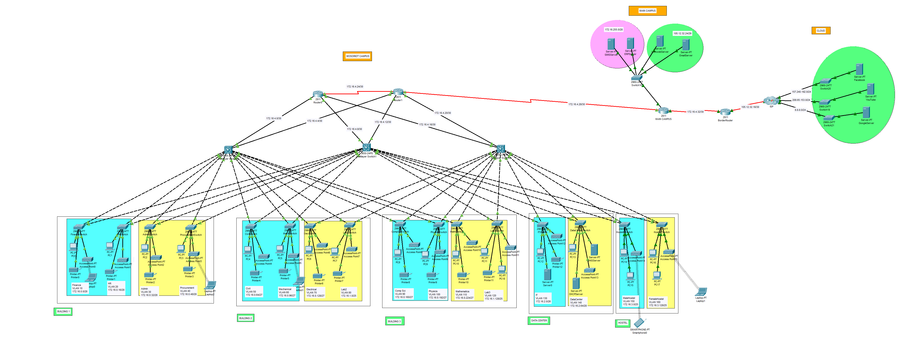

# Networking Infrastructure Design for Koitalel arap Samoei University College

Video [link](https://youtu.be/QJCHFcZ7Vaw)

## **Project Overview**
Koitalel arap Samoei University College (KSUC), a constituent college of the University of Nairobi, requires the installation of a robust networking infrastructure at its Mosoriot campus located in Nandi County. The infrastructure will include Local Area Networks (LANs), a backbone connection using fiber, server-room LANs, and wireless LANs, all interconnected to support the campus's academic and administrative activities.